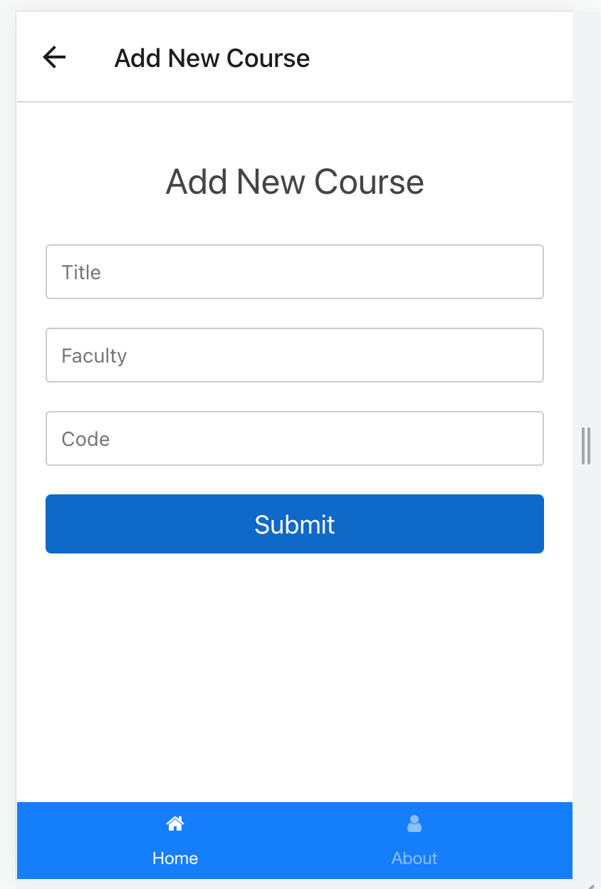
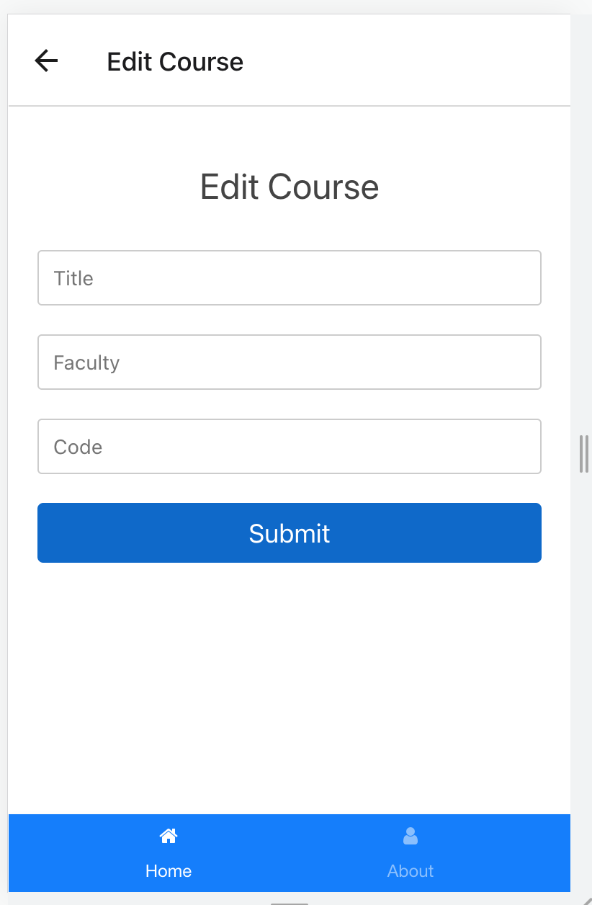

# CS571 Workshop 04 - Continued
## MIU Courses Review App
1. Create a new project
2. Copy all source code from the previous workshop to this project
## Add the following features this app
* Assume that you have the `json-server` with the database `db.json`. Please check the directory `server`.
1. Show all reviews of a course in the screen 'CourseDetails'
2. Update this app to get/save the courses from database, not from the local storage.
3. Implment `AddCourse` component to add a new course
4. Implment `UpdateCourse` component to update an existing course. Do not allow to update the code of this course.
5. Implement a feature to delete a course. For deleting a course, you just need to display an alert to confirm `Do you want to delete this course?`. Please check the following code for Alert of React Native.
```JavaScript
    Alert.alert('Alert Title', 'My Alert Msg', [
      {
        text: 'Cancel',
        onPress: () => console.log('Cancel Pressed')
      },
      {
        text: 'OK', 
        onPress: () => console.log('OK Pressed')
      },
    ]);
```
6. Implement the Login screen that users can sign in using their emails. If the email is in the database, the users can access the courses. Otherwise, just display a message `Wrong email`. Provide the mechanism that do not require users to log in again whenever opening this app. Implement the function to log out.

## Notes  
* Provid simple StyleSheet object.
* Do not upload any zip files into your repo.
* Do not push any deps (node_modules).
* Remember to honor the project integrity and authenticity of your code.

## Please find screenshots for the finished application  

  
  

